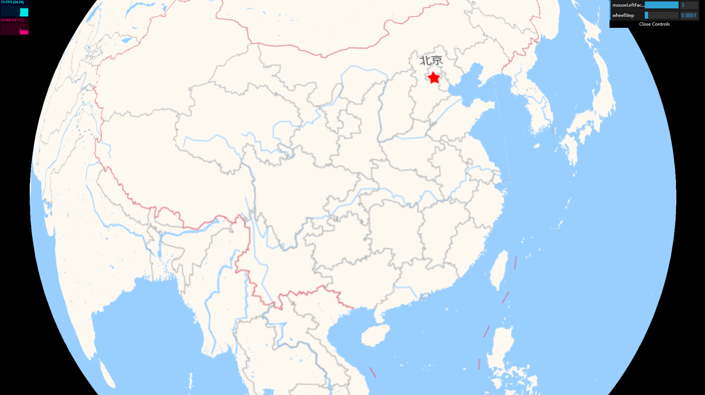
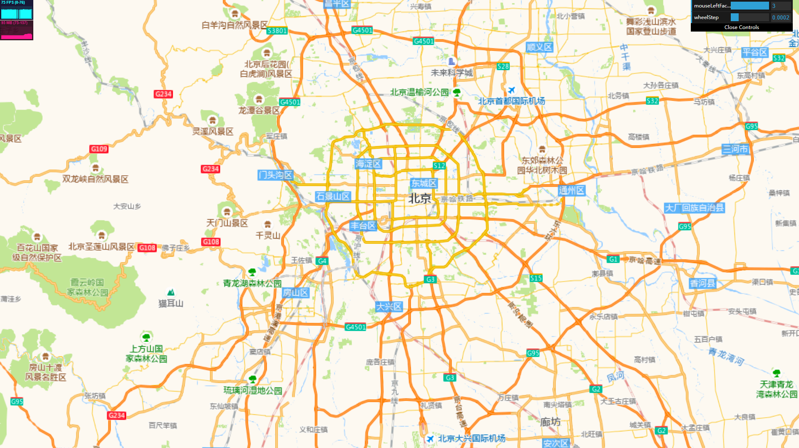
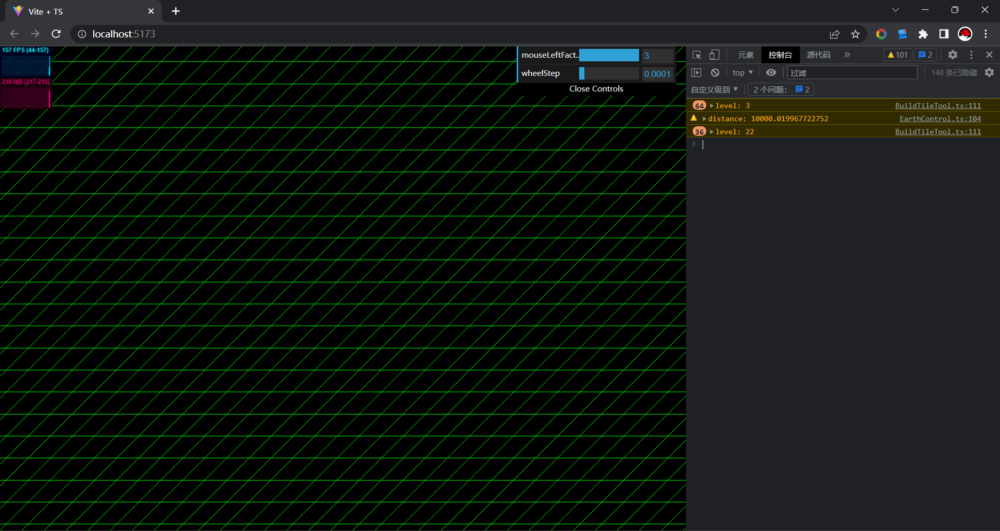
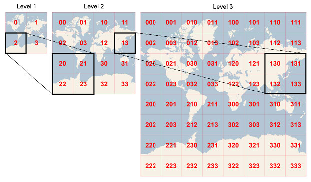

# Orillusion_TileEarth

这是一个基于Orillusion的瓦片地球Demo



## 运行

```js
yarn //或 npm i
yarn dev//或 npm run dev
```


## 关于大地坐标系精度(64float)问题

这里是Orillusion帮助解决的，在星球的尺度上也能正常渲染不限于GPU只支持的21公里



## 地图瓦片系统

这里使用的是<a href="https://learn.microsoft.com/en-us/bingmaps/articles/bing-maps-tile-system" rel="nofollow">Bing Maps Tile System</a>



